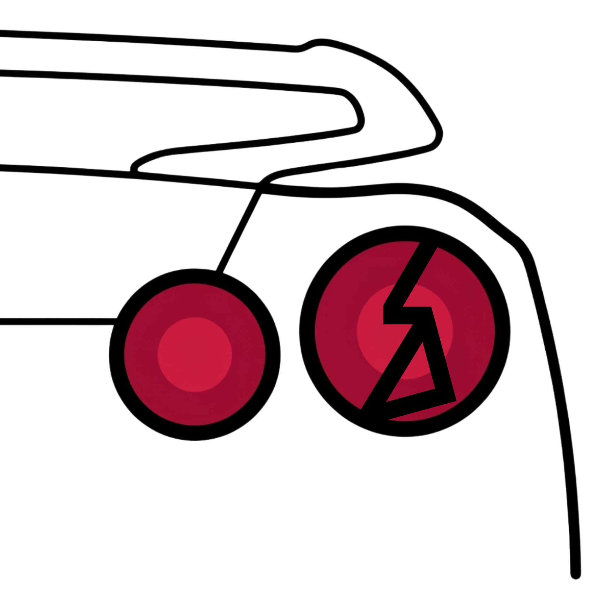

<div align="center">

  

  # 🚗 LecetDikit

  **Sistem Inspeksi Otomotif Berbasis AI dengan Presisi Tinggi**

  [](https://flutter.dev/)
  [](https://dart.dev/)
  [](https://www.tensorflow.org/lite)
  [](https://firebase.google.com/)
  [](https://opensource.org/licenses/MIT)

  <p align="center">
    <b>Deteksi kerusakan bodi kendaraan secara instan, akurat, dan langsung dari perangkat Anda!</b><br>
    Aplikasi inspeksi visual otomotif bertenaga Computer Vision untuk hasil deteksi presisi tinggi.
  </p>
</div>

<br>

## 📋 Tentang Aplikasi

**LecetDikit** adalah aplikasi *mobile* berbasis Flutter yang memanfaatkan teknologi Artificial Intelligence (AI) dan Machine Learning untuk mengotomatisasi deteksi lecet maupun kerusakan eksterior pada kendaraan mobil. Dirancang dengan antarmuka modern bermaterial 3 dan sistem pemrosesan gambar mutakhir, aplikasi ini mempercepat proses inspeksi klaim asuransi, operasional *car rental*, maupun pengecekan rutin bengkel/pribadi.

Aplikasi ini menggunakan model Deep Learning terspesialisasi (`best_float32.tflite`) yang berjalan langsung di dalam perangkat (*on-device inference*), dipadukan dengan sinkronisasi cloud real-time menggunakan Firebase untuk penyimpanan riwayat inspeksi.

---

## ✨ Fitur Unggulan

Aplikasi ini dikembangkan dengan fitur-fitur lengkap:

### 🧠 Inspeksi Kendaraan Berbasis AI
- **On-Device Object Detection:** Menjalankan model TensorFlow Lite secara lokal untuk mendeteksi lecet, penyok, dan goresan pada bodi mobil tanpa ketergantungan penuh pada internet.
- **Image Processing Efektif:** Normalisasi dan manipulasi resolusi gambar otomatis sebelum dimasukkan ke model agar akurasi deteksi tetap tinggi.
- **Interactive Bounding Box:** Visualisasi kotak pembatas (*bounding box*) kerusakan yang responsif langsung di atas gambar mobil.

### 🔐 Multi-Method Authentication & Akun
- **Otentikasi Berlapis:** Mendukung pendaftaran akun baru dengan validasi kata sandi ganda (Confirm Password) untuk menghindari *typo*.
- **Google Sign-In v7 terintegrasi:** Akses masuk cepat satu ketukan menggunakan akun Google Anda via *Credential Manager* yang aman di mode debug maupun rilis.
- **Mode Tamu (Guest Mode):** Menggunakan fitur *Anonymous Sign-In* Firebase agar pengguna dapat langsung mencoba kapabilitas aplikasi tanpa registrasi awal.
- **Forced Profile Setup:** Sinkronisasi nama dan penyiapan detail akun secara otomatis saat pertama kali mendaftar sebelum dialihkan ke dashboard utama.

### 📄 Ekspor Laporan & Riwayat
- **Laporan PDF Profesional:** Konversi instan hasil analisis kerusakan visual menjadi file dokumen PDF yang terstruktur dengan desain bersih dan siap pakai.
- **Fitur Berbagi & Cetak:** Dukungan integrasi pencetakan langsung (*direct printing*) atau berbagi dokumen laporan digital hasil inspeksi ke platform pesan/cloud.
- **Riwayat Tersinkron:** Rekam mutasi data hasil inspeksi secara terpusat di Cloud Firestore untuk akurasi pelacakan jangka panjang.

### 🎨 Personalisasi & UI Modern
- **Tri-Theme Mode Switcher:** Pilihan 3 pengaturan tema dinamis (*System Default*, *Light Mode*, dan *Dark Mode*). 🌙
- **Persistent Theme Storage:** Menggunakan *SharedPreferences* berbasis String sehingga preferensi tema pengguna tetap tersimpan utuh saat aplikasi ditutup dan dibuka kembali.

---

## 🛠️ Teknologi yang Digunakan

- **Framework:** [Flutter](https://flutter.dev)
- **Language:** [Dart](https://dart.dev)
- **AI/ML Engine:** [tflite_flutter](https://pub.dev/packages/tflite_flutter) (v0.12.1)
- **Image Manipulation:** [image](https://pub.dev/packages/image) (v4.1.7)
- **Backend & Database:** [cloud_firestore](https://pub.dev/packages/cloud_firestore) & [firebase_core](https://pub.dev/packages/firebase_core)
- **Authentication:** [firebase_auth](https://pub.dev/packages/firebase_auth) & [google_sign_in](https://pub.dev/packages/google_sign_in) (v7.2.0)
- **Local Storage:** [shared_preferences](https://pub.dev/packages/shared_preferences)
- **Reporting & Printing:** [pdf](https://pub.dev/packages/pdf) & [printing](https://pub.dev/packages/printing)
- **Media Capture:** [image_picker](https://pub.dev/packages/image_picker) & [path_provider](https://pub.dev/packages/path_provider)

---

## 🚀 Cara Instalasi & Build

Ikuti langkah ini untuk menjalankan proyek di mesin lokal Anda:

### 1. Clone Repositori
```bash
git clone [https://github.com/username-anda/ai-vehicle-inspection-lecetdikit.git](https://github.com/username-anda/ai-vehicle-inspection-lecetdikit.git)
cd ai-vehicle-inspection-lecetdikit
```

### 2. Konfigurasi Firebase
Aplikasi ini membutuhkan berkas konfigurasi Firebase. Pastikan Anda telah mengaktifkan proyek baru di Firebase Console:
1. Jalankan perintah `flutterfire configure` atau buat file `lib/firebase_options.dart` Anda sendiri.
2. Unduh file `google-services.json` untuk Android dan tempatkan di dalam direktori `android/app/`.

### 3. Install Dependencies
```bash
flutter pub get
```

### 4. Jalankan Aplikasi (Debug)
```bash
flutter run
```

### 5. Build APK Rilis dengan Keystore & Server Client ID ⚠️
Untuk mem-build APK versi rilis agar fitur Google Sign-In v7 tetap berjalan dengan lancar, pastikan Anda telah melakukan konfigurasi berikut:

1. **Keystore Penandatanganan:** Buat file *Release Keystore* resmi (`upload-keystore.jks`) di folder `android/app/`, buat file `key.properties` di folder `android/`, lalu hubungkan ke `android/app/build.gradle.kts`.
2. **Daftarkan SHA-1 & SHA-256 Rilis:** Jalankan `./gradlew signingReport` di dalam folder android, salin SHA-1 milik `Variant: release`, lalu daftarkan sidik jari tersebut ke Firebase Console Anda. Unduh ulang file `google-services.json` terbaru setelah mendaftarkannya.
3. **Web Client ID:** Buka `lib/services/auth_service.dart`, pastikan Anda sudah memasukkan Web Client ID dari Firebase Console ke dalam parameter `serverClientId` pada inisialisasi `GoogleSignIn` Anda untuk mendukung sistem otentikasi Android rilis:
   ```dart
   final GoogleSignIn _googleSignIn = GoogleSignIn(
     serverClientId: 'YOUR_WEB_CLIENT_ID.apps.googleusercontent.com',
   );
   ```
   
Setelah semua konfigurasi rilis di atas selesai, Anda dapat mem-build APK rilis resmi dengan aman menggunakan perintah:
```bash
flutter build apk
```

---

## 🤝 Kontribusi

Kontribusi selalu terbuka! Jika Anda ingin menambahkan kapabilitas model baru, mengoptimalkan kecepatan inferensi bounding box, memperbaiki bug, atau meningkatkan dokumentasi:

1. **Fork** repositori ini.
2. Buat branch fitur baru (`git checkout -b fitur-inspeksi-baru`).
3. **Commit** perubahan Anda (`git commit -m 'Menambahkan optimasi normalisasi citra model'`).
4. **Push** ke branch (`git push origin fitur-inspeksi-baru`).
5. Buat **Pull Request** baru.

---

## 📝 Lisensi

Proyek ini didistribusikan di bawah **MIT License**. Silakan lihat file [LICENSE](LICENSE) untuk informasi lebih lanjut.

<br>

<div align="center">
  <p>Made with ❤️ by ahdarin</p>
  <p>June, 2026</p>
</div>
